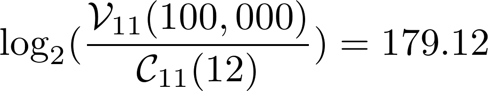

# Sweet Fuzzy Secrets

<center>Daniel Buchner</center>
<center>May 1, 2018</center>

### <center>Abstract</center>
Systems where users are responsible for ownership and management of sensitive data (e.g. private keys) have long suffered a lack of human-friendly mechanisms for access, storage, and recovery. Existing solutions, such as Password-based Encryption (PBE), threshold secret sharing (e.g. Shamir), and hardware factors are all subject to negative tradeoffs in security and ease of use that degrade their viability for non-technical users. This paper introduces the possibility of a new scheme that may enable more human-friendly key management paradigms.

The scheme proposed in this paper seeks to provide secure storage and regeneration of sensitive data by allowing fuzzy recollection and recombination of an T threshold of user-selected, human-meaningful inputs, wherein recollection needn't precisely match the original set of N total human-meaningful inputs. This scheme uses a simple format-preserving transform that merges a set of N human-meaningful inputs with a matching number secret share values (e.g. 32 byte hexidecimal strings) to generate altered values that can only be effectively recombine when T threshold of N original human-meaningful inputs are provided. Example: imagine being able to describe an experience from your life, for which you know intimate, secret aspects, and use that to secure a piece of sensitive data in a way that allows you to recollect the same experience with some variability and still recover the data. That is but one example - this construction allows for almost any form of input to be used as a factor, including: user-meaningful passphrases, GPS locations, PIN numbers, biometric values, etc.

## Background & Inspiration

There are many ways to encrypt and secure data, but most have unfortunate tradeoffs that affect their security or ability to be used effectively by the vast majority of users. Many of the more human-friendly means of securing data involve physically hiding inputs (QR codes) or remembering abstract inputs (high-entropy passwords, mnemonic phrases, etc.) with exact precision. Additionally, the level of security most methods deliver is inverse to the level of difficulty users must shoulder - and as we know, high security that requires high user pain is not a recipe for success.

The mechanism of fuzzy recombination of human-friendly inputs for regeneration of sensitive data described in this paper builds upon cryptograpihic schemes, ideas, and learnings present in existing threshold secret constructions, and papers on Honey Encryption by Jaeger, Ristenpart, Tang, Tyagi, Wang, Wen, and Zuo. [1] [2] [3].

**Honey Encryption** is a scheme first introduced by Juels and Ristenpart [4] that proposed a means to achieve security for low-entropy keys, even when an attacker has access to the ciphertext and can attempt to decrypt with all possible/probable keys. Honey Encryption (HE) does this by ensuring all plaintexts generated during a brute-force attack look plausible across a target distribution of expected outputs. Juels and Ristenpart also provided a framework for building HE schemes, including the composition of distribution-transforming encoders (DTE). A DTE is a form of randomized encoding scheme that is specifically constructed to output values in accordance with a target distribution of a given value type. Research of various Honey Encryption variants inspired the 'fuzzy' threshold portion of the scheme outlined in this paper.

**Secret sharing** (also called secret splitting) refers to methods for distributing a secret amongst a group of participants or destinations, each of whom is allocated a share of the secret. The secret can be reconstructed only when a sufficient number of shares are combined together; individual shares are of no use on their own.

In one type of secret sharing scheme there is one dealer and N players. The dealer gives a share of the secret to the players, but only when specific conditions are fulfilled will the players be able to reconstruct the secret from their shares. The dealer accomplishes this by giving each player a share in such a way that any threshold of T or more players can together reconstruct the secret, but no group of fewer than T players can. Such a system is called a (T, N)-threshold scheme. [5] Secret sharing was invented independently by Adi Shamir [6] and George Blakley [7] in 1979.

## Overview of the Construction

In order to ground ourselves in a use-case that illustrates the purpose, intent, and application of this encryption scheme, we will examine the case of a user-meaningful passphrase. We will assume the user desires to recover their secret in a way that allows for fuzzy recollection of the original passphrase, and apply the proposed scheme to enable this.

To start, assume the user enters the following secret and passphrase:

Secret: `007`

Passphrase: `I sat next to Chef Morimoto at the bar in Cin Cin restaurant and got his autograph on a napkin. He was with the head chef from the restaurant he opened in Napa.`

In common PBE schemes, the passphrase above would need to be input exactly as originally entered, which is a significant barrier to human-friendly use. While these schemes are useful in some cases, we seek a method that allows for fuzzy variability of input that still results in the recovery of the encrypted secret. To do so, we'll need more than just a simple PBE scheme.

### Format-Preserving Transformation of Threshold Shares

To augment our example input, a passphrase, with the fuzzy recollection feature, we propose the following construction:

Assume the user's passphrase (above) is run through a well-known, standard filter that outputs an array of 12 significant input segments, in accordance with an implementation-canonical dictionary: `['sat', 'next', 'chef', 'morimoto', 'bar', 'cin', 'restaurant', 'autograph', 'napkin', 'head', 'opened', 'napa']`

Next we use an implementation of Shamir threshold secrets to encrypt our secret, `007`, with a total number of shares that matches our total passphrase segment count and set an entropy-significant N threshold. The result of encrypting our secret with the Shamir threshold implementation is an array of shares composed of hexadecimal strings: `['801c13a8e859b1d857267d2a418c740f', ...]`.

We now have two arrays of equal length, and perform the following steps:

1. Begin iterating the array of hexadecimal threshold secret value to generate a map of transformed values.

2. For each iteration, convert the hexadecimal share and the passphrase segment at the same index to decimal notation.

3. For each iteration, subtract the decimal value of the passphrase segment from the decimal value of the secret share, then return the result in hexadecimal notation.

*Pseudo code for honeying shares:*

```javascript
var honeyInputs = ['sat', 'next', 'chef', ...];
var secretShares = ['801c13a8e859b1d857267d2a418c740f', ...];
var honiedShares = secretShares.map((share, i) => {
  return hexToDecimal(share) - inputToDecimal(honeyInputs[i]);
})
```

The resulting array is 12 hexadecimal values that have been transformed to seemingly valid threshold secret shares, but have been honied by modifying their values in relation to the paired inputs. Exposed at rest, these shares appear as valid as any other set of threshold secret shares, but no combination of the shares can be used to retrieve the secret without reapplying their honey values.

### Reassembly of Shares & Regeneration of Secret

To reassemble the shares and regenerate the secret, we must reapply the decimal value of the honey inputs from our passphrase to the honied share values. If we store the honied values in the same order as the filtered passphrase values we used to modify them, and recollected the passphrase exactly, it would simply be a process of iterating the arrays and adding each passphrase segment's decimal value back into its corresponding modified share. However, if we recollected the passphrase differently than when we generated the shares, or randomized the honied share positions, the array values would not align in some or all places, which would generate invalid shares when their value pairs are merged.

##### The Brute Force is With You

In order to recombine the honey inputs with their shares correctly (without an assumption of perfect alignment) we iterate through all possible permutations of inputs, add back in the input values to all non-repeating share combinations, and attempting decrypt the resulting values with the Shamir implementation decryption function.

*Pseudo code for generation of possible share values:*

```javascript
var secretHash = 'a0ccfef874...';
var recollectedInputs = ['sitting', 'next', 'chef', ...];
var honiedShares = ['801c13a8e859b1d857267d2a418c740f', ...];

async function retrieveSecret(threshold, shares, inputs, hash){
  var secret;
  var inputCombinations = combinations(inputs, threshold);
  var inputSet = inputCombinations.next();
  while (inputSet) {
    var sharePermutations = permutations(honiedShares, threshold);
    await sharePermutations.find(shareSet => {
      var shares = recollectedInputs.map((input, i) => assembleShare(input, shareSet[i]));
      var output = secrets.combine(shares);
      if (generateHash(output) === hash) {
        secret = output;
        return true;
      }
    });
    inputSet = inputCombinations.next();
  }
  return secret;
}

var secret = retrieveSecret(8, honiedShares, recollectedInputs, secretHash);

if (secret) console.log('Yay, found your secret!');
else console.warn('Nice try, bad guy.');
```

This process of iteration and recombination of all possible share combinations, and the time it takes to complete, is dependent on the T threshold and N total count of initial inputs used to generate the resulting set of honied shares. The larger the threshold and total set of inputs/shares, the longer the recovery process will take.

## Entropy & Security

> Note: The author of this paper is not a cryptographer, and as such is not qualified to reliably assess the effective entropy of a system based on human-friendly inputs. The best this author can do is postulate about raw entropy and general security, but the calculations below could be wrong, and the author welcomes your correction and feedback.

If we assume the honey input message space includes significant words and names that adhere to a standard filter (excludes pronouns, conjunctions, etc.), as well as other factors, such as biometric values, GPS coordinate grid references, etc., the number of possible inputs could easily number in the millions. To calculate the entropy of the construction requires examining the combinatorial probability of an attacker guessing not only a correct set of honey inputs that exceeds the threshold used during construction, but also having to combine each input with the exact share it was paired with during the honey transform phase.

The following is an attempt at calculating the entropy bits of the scheme. It assumes at least one correct set of inputs exists within all permutations of the total message space _M_, when iterated choosing a share count _n_ that meets or exceeds the threshold used during construction. To ensure that the share count chosen will always meet or exceed the threshold, the attacker would have to select _n - 1_, wherein _n_ is the total share count.

<!--
$$
  S = {
    \log_{2}(
      {\mathcal{V}_{n - 1}(\mathcal{M}) \over{\mathcal{C}_{n - 1}(n)}}
    ) 
  }
$$
-->


The author suspects attackers would likely optimize their attempts in a number of ways:

1. Use a smaller threshold count for permutation iteration based on known threshold norms used in popular secret construction implementations.
2. Spawn multiple threads/jobs (one per combination?) to iterate the permutations against all unique, non-repeating combination of the selected threshold. The assumption of the author is that iteration of permutations and input/share assembly across multiple share combination sets in parallel would reach a match sooner by compounding match distribution probabilities.

In our example case, the user created 12 shares (_n_), thus (without optimization) the attacker would be required to iterate all permutations of an assumed 100k input message space using 11 as the set section size (_n - 1_). The number of bits is then equal to the log 2 result of the number of permutations.

<!--
$$
  {
    \log_{2}(
      {\mathcal{V}_{11}(100,000) \over{\mathcal{C}_{11}(12)}}
    ) = 179.12
  }
$$
-->



In contrast, the user is only required to iterate and attempt share reassembly for the number of permutations based on the inputs they recollect. We'll assume the user entered 14 inputs, a worst case condition that only 8 were correct, and use a set selection size that exactly matches the threshold they used:

<!--
$$
  {
    \log_{2}(
      \mathcal{V}_{8}(14)
    ) = 26.85
  }
$$
-->


There are a number of important questions as we consider the viability of this construction:

1. What is the disparity between the raw and effective entropy when we assume the inputs are human-meaningful?
2. Is the effective entropy high enough that the honied shares can be exposed at rest to attackers and still secure against a targeted brute force attack?
3. Because the honied shares will likely not align with the recollected input set, is the level of computation required from users recovering their secrets too high to effectively recover within a feasible range?
4. Assuming all the questions above are satisfied, how likely is it a user can be guided to generate human-meaningful inputs that:
    - Are not composed of weak, generic inputs that share common traits which reduce the probable input range for attackers.
    - Are unlikely to be inputs the user frequently exposes through other mediums, opening them up to specific analysis and targeted, efficient attack.

## Conclusion

As previously stated, the author is not a cryptographer, and the intent of this paper is to provide a hypothesis about one possible solution for fuzziness in recovery of secrets. It is the hope of the author that you will help evaluate this proposal in light of the questions and issues it presents, to determine the efficacy and viability of what it proposes.

## Citations

[1] Joseph Jaeger, Thomas Ristenpart, and Qiang Tang. Honey Encryption Beyond Message Recovery Security. February 23, 2016.

[2] Nirvan Tyagi, Jessica Wang, Kevin Wen, Daniel Zuo. Honey Encryption Applications. Implementation of an encryption scheme resilient to brute-force attacks. Computer & Network Security, Spring 2015. 

[3] B. Kausik. Method and apparatus for cryptographically camouflaged cryptographic key storage, certification and use, Jan. 2 2001.

[4] A. Juels and T. Ristenpart. Honey encryption: Security beyond the brute-force bound. In Advances in Cryptology - EUROCRYPT 2014 - 33rd Annual International Conference on the Theory and Applications of Cryptographic Techniques, Copenhagen, Denmark, May 11-15, 2014. Proceedings, pages 293–310, 2014.

[5] Generic description of Secret Sharing schemes. https://en.wikipedia.org/wiki/Secret_sharing

[6] Shamir, Adi (1979). "How to share a secret". Communications of the ACM 22 (11): 612–613.

[7] Blakley, G. R. (1979). "Safeguarding cryptographic keys". Proceedings of the National Computer Conference 48: 313–317.